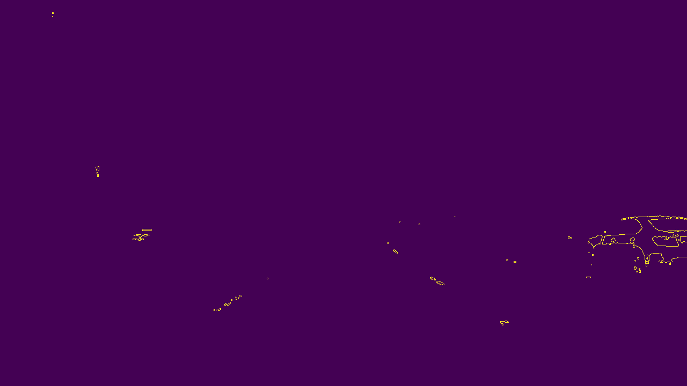
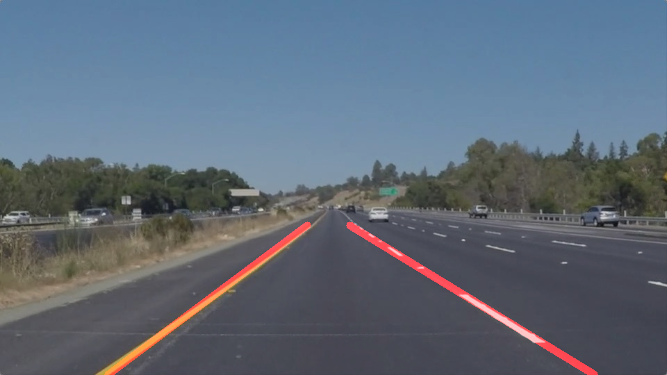

# **Finding Lane Lines on the Road** (report by João Sousa-Pinto)

## Objectives

The goal of this project was to find lane lines on images/videos taken from a moving vehicle. The first task was to annotate these lines as line segments, and the second was to cluster these segments into two big lines corresponding to the left and right boundaries of the lane in which our car is circulating.

## Approach

The pipeline for extracting lane markings from the provided images/videos can be decomposed, at a high level, into the following steps.

1. Apply thresholding on the relevant color channels (in our case, Red and Green, since white is `(255,255,255)` and yellow is `(255,255,0)`); after some parameter tuning, I chose to require `R>220` and `B>180`. Most of the work is done by the thresholding on the red channel. This step was mostly helpful to deal with the `challenge.mp4` video, and can be avoided for the other ones.

2. Convert the thresholded RGB image to grayscale, using the provided `grayscale` helper function (which in turn calls `cv2.cvtColor`).

3. At this point, I applied an [adaptive thresholding algorithm](http://docs.opencv.org/3.2.0/d7/d4d/tutorial_py_thresholding.html), namely the Gaussian one, with a 3-by-3 kernel. This was mostly aimed at solving the challenge at the end,
and can otherwise be avoided.

4. Select a region of interest where the lane boundaries will fall, shaped like an isosceles trapezium, and color all pixels outside that as black.

5. Apply an edge-detection algorithm (we used Canny's, but there is a plethora of algorithms to choose from, including the Laplacian of Gaussians method).

6. Make use of Hough's method to detect parameterized objects (in our case, line segments).

For the purpose of detecting line segments, the steps above suffice. For detecting the two boundary lines entirely, some post-processing, described below, is required.

7. For each detected line segment (which `cv2.HoughLinesP` describes by providing both end-points), I compute the `(ρ, d)`-parameterization of its embedding line.
We remind the reader that all lines can be described via an equation of the form `x cos(θ) + y sin(θ) = d`,
where we always express ρ modulo π.

8. With the purpose of finding the two main cluster centers on the θ parameter space, we use a voting scheme. The range `[0,π)` is divided into intervals of
5 degrees each (therefore, 36 intervals in total). The first cluster center is selected to be the arithmetic mean of the points falling under the most voted interval.
After erasing that interval and the adjacent ones (to compensate for discretization errors), the second cluster center is selected in a similar fashion.
Note that, for the purpose of removing outliers, we apply a "verticality filter", essentially impeding lines that are too horizontal from being selected.
This is generally not necessary, but was added for robustness purposes.

9. Finally, the d-value corresponding to each θ-value is computed by taking an average of the d-values yielded by the points associated with each θ-cluster.
This can alternatively be seen as a least squares estimator for d once the values for θ are fixed.

We draw these lines by hand-picking the `y`-values where we want them to be visible (namely, from `0.6` to `1.0` times the size of the image in the `y` direction).

## Step-by-step evaluation on two hard images (extracted from key moments of challenge.mp4)

Initially, the evaluation images are as follows:

They are, respectively, the frames at times `4.0` and `5.92` of `challenge.mp4`.
After applying some simple thresholding on the red and green color-channels, we get the following images:

Beware that these images were chosen due to their difficulty; the thresholding levels were selected to be quite aggressive, which worked very well on the first image, and not so well in the second, although it did leave enough traces of the lane markings, allowing the following steps to run successfully.
The images are then converted to gray-scale (rendered on the green color-channel below for code simplicity):

Gaussian adaptive thresholding is then adapted:

Then Canny's algorithm is applied:

The regions of interest are then selected, and everything else removed (note that this should have been done earlier in the pipeline for efficiency reasons).

Finally, we use our clustering algorithm from `draw_lines` to select and draw the appropriate lane markings.

Note that these images were obtained by returning early from our pipeline (the function `annotate`)

## Shortcomings and possible improvements

Due to time constraints, I spent only the necessary amount of time to make the code work decently on the provided examples, including the challenge. It would be very interesting to include a contrast-improvement method in the pipeline, such as [histogram equalization](https://opencv-python-tutroals.readthedocs.io/en/latest/py_tutorials/py_imgproc/py_histograms/py_histogram_equalization/py_histogram_equalization.html). This would have definitely helped with the challenge, although my simpler strategy of using thresholding did the job (although in a less robust way). Similarly, other steps for normalizing the input images/videos would make the pipeline more robust.
There is also room for improving the way the discretization of the voting-based clustering algorithm used in `draw_lines` works. It often happens that many line segments corresponding to the same θ fall under adjacent (but different) classes, which results in their values being ignored for the purpose of estimating the corresponding lane direction.
In fact, one could avoid doing this altogether, by implementing Hough's algorithm for lines (instead of line segments), which would be a more robust approach than doing line-segment detection following by clustering.
It would also be interesting to use Hough's algorithm with some spline-like curves (possibly) to try to fit curved lane markings.

## Results on given images (full lines)
`solidWhiteCurve.jpg`

`solidWhiteRight.jpg`

`solidYellowCurve.jpg`

`solidYellowCurve2.jpg`

`solidYellowLeft.jpg`

`whiteCarLaneSwitch.jpg`

Note that annotations with line segments instead of full lines can be obtained by replacing the `draw_lines` function with `draw_lines_original`. For the sake of simplicity, the corresponding images are omitted from this report.

## Results on given videos

The annotated videos can be found in [solidWhiteRight.mp4](./test_videos_output/solidWhiteRight.mp4), [solidYellowLeft.mp4](./test_videos_output/solidYellowLeft.mp4), and [challenge.mp4](./test_videos_output/challenge.mp4).
